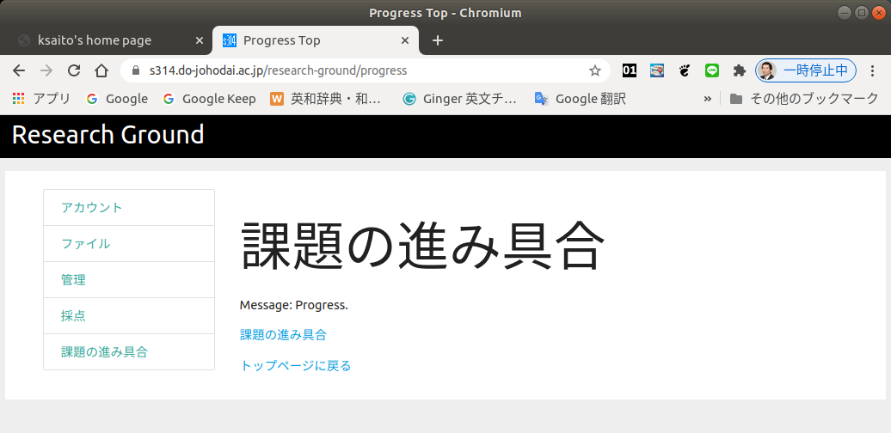
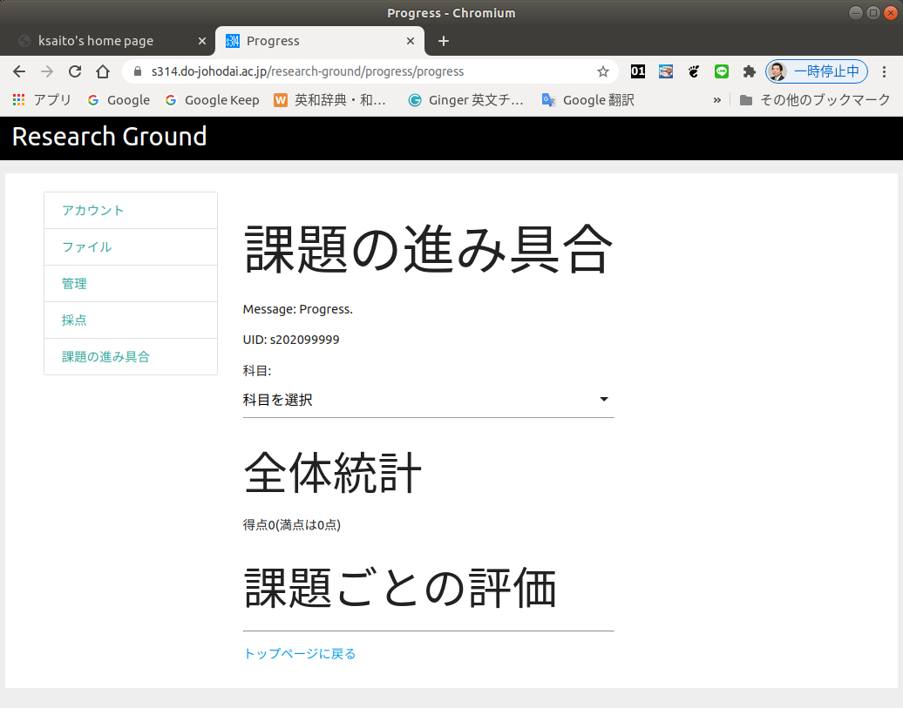
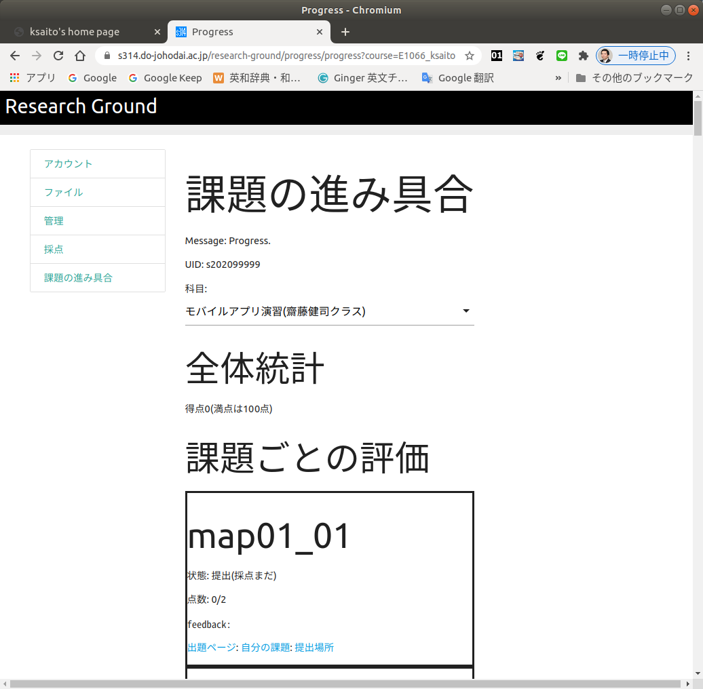

提出状況の確認
========================================

課題を提出し終えたら、必ず課題の提出状況を確認しましょう。
Research Groundのトップページから「課題の進み具合」を選択すると
以下の画面になります。

ここでさらに「課題の進み具合」のリンクをクリックすると以下の
画面になります。

この画面の「科目を選択」のリストボックスをクリクし、自分が履修している
授業を選択して下さい。以下のように画面が変ります。

下の方にスクロールすると全ての課題の状態が表示されます。
課題ごとの評価の中には、課題提出の状況点数、フィートバックが表示されます。
さらにその下には「課題のページ(授業の資料で出題が出題されているページ)」
「自分の課題(アップロードした課題がどう見えるか)」「提出場所(課題を提出
するためのページ)」へのリンクがあります。

特に「状態」の所が「提出」となってなければ、ファイルのアップロードに
失敗していたり、ファイル名をちょっと間違っているなどの可能性があります。
再度チェックして提出してみて下さい。そして、「自分の課題」のリンクで、
課題がちゃんとアップロードされているか表示して確認して下さい。例えば、
画像ファイルをアップロードし忘れていれば画像の部分だけが表示されない
などの不具合を確認することができます。自分のコンピューターの中だけで
上手く表示されていても、ここで上手く表示されなければちゃんと評価して
もらえないので、提出後に必ず確認しておきましょう。

[Research Groundの説明のトップに戻る](./)
