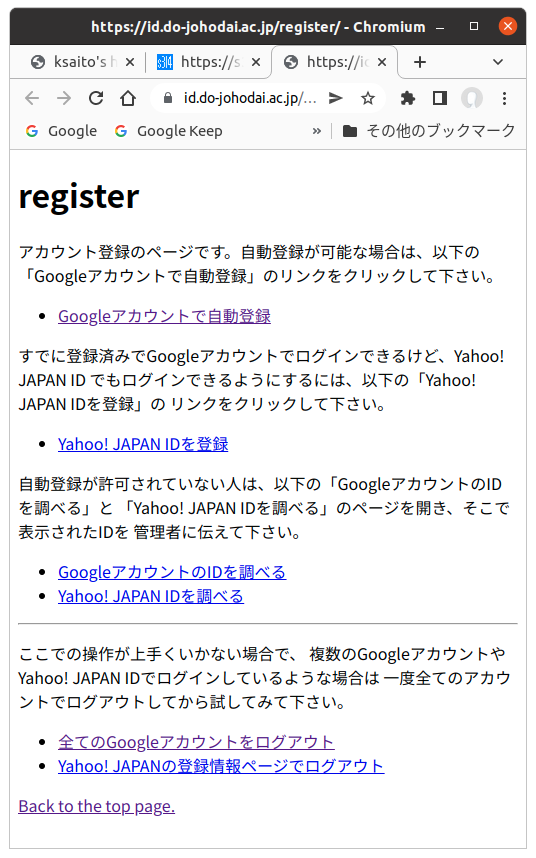
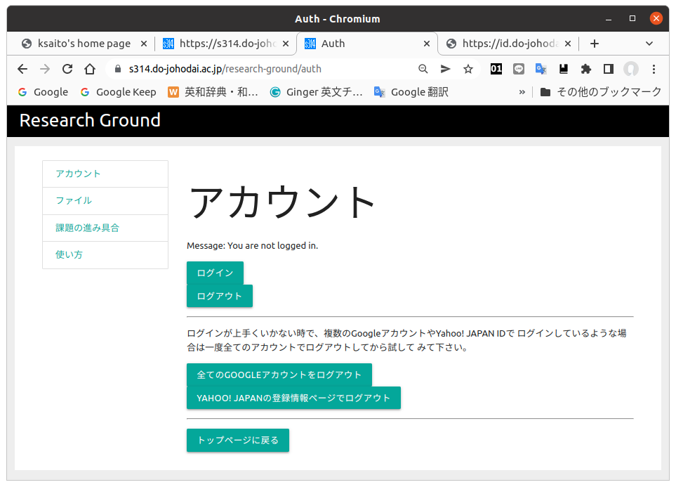

ユーザー登録
========================================

Research Groundを利用するには初めに一回だけ
簡単なユーザー登録作業が必要になります。
Research Groundの認証は外部の認証サーバーを
使用しているのでアドレスがちょっと変りますが
間違いではありません。まず以下のリンク先の
ページを開いて下さい。

* idsrv register
    + <a href="https://id.do-johodai.ac.jp/register/" target="_brank">https://id.do-johodai.ac.jp/register/</a>

以下のような画面が表示されます。

この認証サーバーでは新にユーザー名やパスワードを登録して
もらうかわりに、大学のメールを読む時に使用しているGoogle
アカウントを使用します。普段、大学のGoogleアカウントだけでなく
他のGoogleアカウントも使用していおり、現在もログイン中の場合には、
ユーザー登録が上手くいかない場合があるので、このページで
「全てのGoogleアカウントをログアウト」というリンクがあるので
クリックして下さい。ブラウザに別のタブが表示されると思いますが、
それが表示されればログアウト完了なのですぐに閉じてしまってかまいません。

次に「Googleアカウントで自動登録」をクリックして下さい。
ここから先は人によって表示される画面が異なることがあります。
以下の画面のようにGoogleにログインするためのメールアドレスを
入力する画面が出てきたり、Googleアカウントの一覧が出て
選択する画面になったりします。

いずれの場合でもGoogleアカウントの情報を入れてログインする
ことになりますが、**ここで間違わないで下さい。必ず大学の
メールを読む場合のGoogleアカウントを選択すしてログインして
下さい。**途中でいくつかの権限の許可を求める画面が出るかも
しれませんが、全て許可して下さい。

登録が完了すると以下のような画面が出てきます。

以後Reserch Groundのシステムでログインが可能になります。
実際にResearch Groundにログインしてみましょう。以下の
リンクをクリックしてResearch Groundのトップページを開き
ます。

* Research Groundトップページ
    + <a href="https://s314.do-johodai.ac.jp/research-ground/" target="_blank">https://s314.do-johodai.ac.jp/research-ground/</a>

以下のような画面が表示されます。

「アカウント」のリンクをクリックすると以下の画面に移行します。

この画面で「ログイン」を押してログインして下さい。もし上手く
ログインできない時は先「全てのGOOGLEアカウントをログアウト」を
クリックしてログアウトしておくと上手くログインできるようになります。

以下のように、最初に認証サーバーで認証されます。

「Continue」を押すと以下のようにResearch Groundの方で
認証が完了します。

[Research Groundの説明のトップに戻る](./)

