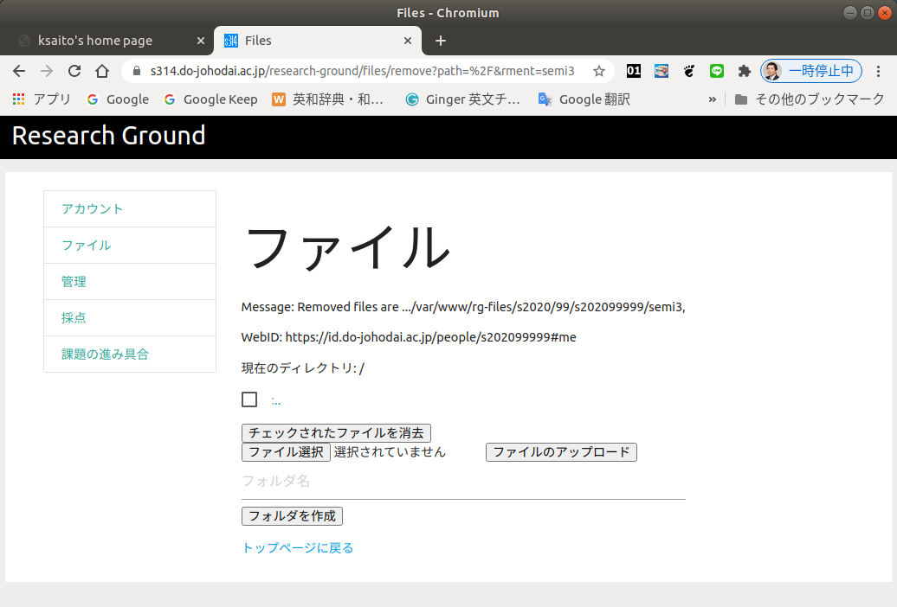
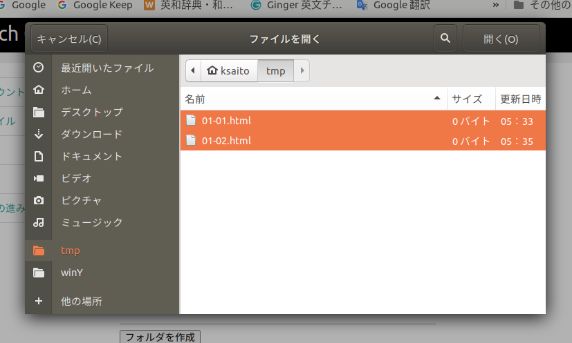

課題の提出
========================================

モバイルアプリ演習の決まり事
----------------------------------------

Research Groundにおける課題の提出方法を説明する前に、
モバイルアプリ演習の授業における課題提出の約束事や
注意点を確認して下さい。

* 課題はResearch Groundのファイルアップロードの機能で提出して下さい。
* ファイルをアップロードする場所には決まりがあります。
    + モバイルアプリ演習の授業用のフォルダ「map」を作って
      全てその中に提出して下さい。
    + 第01回から第12回、そして総合課題ごとに「map」フォルダの
      中にさらにフォルダを作り回ごとに分類して提出して下さい。
    + 課題ごとに提出するファイル名が指定されています。
      一字一句間違えずに(半角の英数字のファイル名ですが
      全角にしたりしないように)提出して下さい。
    + 1つの課題で提出するファイルが、1つとは限りません。
      その課題を表示、動作させるのに必要な物は全て
      アップロードしましょう。
* 課題を提出し終えたら、[提出状況の確認](./confirmation.html)の
  方法で、正しくアップロードできたか、提出ファイルが上手く
  表示されるか、採点後には点数やコメントを確認して下さい。

モバイルアプリ演習における、Research Groundのファイル提出
場所のは以下のように感じになります。

* 「map」フォルダ(モバイルアプリ演習の授業のフォルダ)
    + 「01」フォルダ(第01回の内容の課題を提出するフォルダ)
        - 「01-01.html」ファイル(第01回の最初の課題の提出ファイル)
        - 「01-02.html」ファイル(第01回の2つ目の課題の提出ファイル)
        - ・・・
    + 「02」フォルダ(第02回の内容の課題を提出するフォルダ)
        - ・・・
    + ・・・
        - ・・・
    + 「12」フォルダ(第12回の内容の課題を提出するフォルダ)
        - ・・・
    + 「13」フォルダ(総合課題の課題を提出するフォルダ)
        - 「13-01.html」ファイル
        - 「images」フォルダ(画像を入れておくフォルダ)
            - 「gazou.png」ファイル(画像ファイル)
        

ファイルのアップロード方法
----------------------------------------

ファイルのアップロードはResearch Groundの「ファイル」のページで
行ないます。以下のResearch Groundのトップページから「ファイル」を
選択してページを開いて下さい。もし、ここでログインしていなければ、
自動的にログイン画面に以降するのでログインして下さい。

* Research Groundのトップページ
    + <https://s314.do-johodai.ac.jp/research-ground/>

以下のようなページが表示されるでしょう。

「フォルダ名」の入力欄にフォルダの名前を入れてから「フォルダを作成」
のボタンを押すとフォルダが作成されます。試しにモバイルアプリ演習の
課題を提出するための「map」フォルダを作成してみましょう。

「map」フォルダが作成されたなら「map」のリンクをクリックすることで、
「map」フォルダの中に入ることができます。このフォルダから出たい時は、
「`..`」と書いてあるリンクをクリックします。さらに「map」フォルダの中に
第01回目の課題を提出するための「01」フォルダも作っておくと良いでしょう。

作った課題のファイルをアップロードするには、上の画面で「ファイル選択」
のボタンを押します。以下のような画面が表示されるので、ファイルを選択します。
ここで複数のファイルを選択することも可能です。

ファイルが選択できたら「ファイルのアップロード」のボタンを押して
下さい。

もし、間違ったファイルをアップロードしてしまった場合には、ファイルの
左側のチェックボックスを選択してから「チェックを入れたファイルを消去」の
ボタンを押して下さい。フォルダも消すことができますが、フォルダを消すには、
事前にフォルダの中のファイルを消しておく必要があります。

もう一度繰り返しますが、課題を提出したら[提出状況の確認](./confirmation.html)の
方法で、正しくアップロードできたか、提出ファイルが上手く
表示されるか、採点後には点数やコメントを確認して下さい。

[Research Groundの説明のトップに戻る](./)
